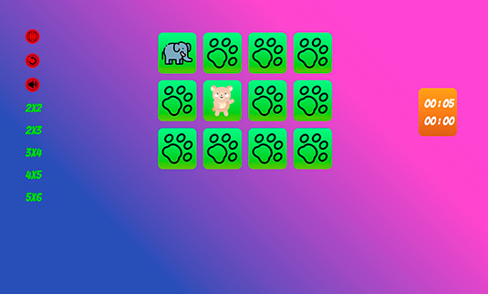

## Picture match

Brain game. Picture match - to find two same picture

- TypeScript,
- React.
- React-redux.

<table>
  <tr><td colspan=2><strong>Game</strong></td></tr>
  <tr>
    <td>

</td>
  </tr>
</table>

### There is problem with reload page because using Github Page. If run local server then all ok.